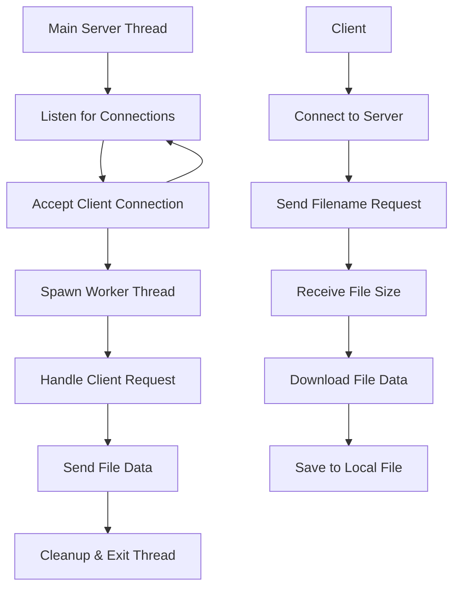

# Basic File Transfer Server

<div align="center">


_A high-performance, multi-threaded TCP file transfer server supporting large files (>4GB) with concurrent client handling_

</div>

---

## Table of Contents

- [Features](#features)
- [Architecture](#architecture)
- [Project Structure](#project-structure)
- [Prerequisites](#prerequisites)
- [Quick Start](#quick-start)
- [Usage](#usage)
- [Testing](#testing)
- [Technical Details](#technical-details)
- [Error Handling](#error-handling)
- [Performance](#performance)
- [Contributing](#contributing)

---

## Features

### Core Capabilities

- **Large File Support**: Handle files larger than 4GB using 64-bit file operations
- **Concurrent Connections**: Multi-threaded server supporting simultaneous clients
- **Cross-Platform Networking**: Built on Winsock2 for Windows environments
- **Real-time Progress**: Live progress tracking for both server and client
- **Error Recovery**: Robust error handling and graceful connection management
- **Memory Safe**: Proper memory allocation and cleanup for all operations

### Advanced Features

- **Thread-safe Operations**: Each client handled in separate threads
- **Network Byte Order**: Proper endianness handling for cross-platform compatibility
- **Automatic File Naming**: Prevents overwriting with `received_` prefix
- **Resource Management**: Automatic cleanup of sockets, files, and memory

---

## Architecture



---

## Project Structure

```
np-project-test/
├── README.md              # This comprehensive guide
├── received_DSC_3293.JPG   # Sample received file
├── test.txt               # Test file for transfers
│
├── server/                # Server implementation
│   ├── server.c           # Main server source code
│   ├── server.exe         # Compiled server executable
│   ├── anishtest.zip      # Large test file (>4GB)
│   └── rnr.JPG            # Additional test file
│
└── client/                # Client implementation
    ├── client.c           # Main client source code
    └── client.exe         # Compiled client executable
```

---

## Prerequisites

### System Requirements

- **Operating System**: Windows 10/11 or Windows Server
- **Compiler**: GCC (MinGW-w64) or Microsoft Visual C++
- **Network**: TCP/IP stack enabled
- **Memory**: Minimum 4MB RAM per concurrent connection

### Development Tools

```bash
# Install MinGW-w64 (recommended)
# Download from: https://www.mingw-w64.org/downloads/

# Or use MSYS2
pacman -S mingw-w64-x86_64-gcc
```

---

## Quick Start

### 1. Clone & Navigate

```bash
git clone <repository-url>
cd "np project test"
```

### 2. Compile the Programs

```bash
# Compile Server
cd server
gcc -o server.exe server.c -lws2_32

# Compile Client
cd ../client
gcc -o client.exe client.c -lws2_32
```

### 3. Run the Server

```bash
cd ../server
./server.exe
```

**Expected Output:**

```
Winsock initialized.
Listening socket created.
Socket bound to port 12345.
Server listening for incoming connections...
```

### 4. Run the Client(s)

```bash
# In a new terminal
cd client
./client.exe
```

---

## Usage

### Server Operation

The server automatically:

1. **Initializes** Winsock2 networking
2. **Binds** to port `12345` on all interfaces
3. **Listens** for incoming connections
4. **Spawns threads** for each client connection
5. **Serves files** from the server directory

### Client Operation

1. **Connect** to server at `127.0.0.1:12345`
2. **Enter filename** when prompted
3. **Monitor progress** during download
4. **Find downloaded file** with `received_` prefix

### Example Session

```bash
# Client Terminal
$ ./client.exe
Winsock initialized.
Client socket created.
Connected to server at 127.0.0.1:12345.
Enter filename to request from server: anishtest.zip
Requested file: 'anishtest.zip'.
Expecting file of size: 4294967296 bytes.
Local file 'received_anishtest.zip' opened for writing.
Received: 4294967296 / 4294967296 bytes
File 'received_anishtest.zip' received successfully. Total received: 4294967296 bytes.
Client disconnected.
```

```bash
# Server Terminal
Thread started for client 127.0.0.1:54321
Client 127.0.0.1:54321 requested file: 'anishtest.zip'
Client 127.0.0.1:54321 - File 'anishtest.zip' found, size: 4294967296 bytes.
Client 127.0.0.1:54321 - Sent: 4294967296 / 4294967296 bytes
Client 127.0.0.1:54321 - File 'anishtest.zip' sent successfully. Total sent: 4294967296 bytes.
Client 127.0.0.1:54321 disconnected.
```

---

## Testing

### Single Client Test

```bash
# Terminal 1: Start server
cd server && ./server.exe

# Terminal 2: Test with small file
cd client && ./client.exe
# Enter: test.txt
```

### Concurrent Client Test

```bash
# Start multiple clients simultaneously
start cmd /k "cd client && client.exe"
start cmd /k "cd client && client.exe"
start cmd /k "cd client && client.exe"
```

### Large File Test

```bash
# Test with files > 4GB
cd client && ./client.exe
# Enter: anishtest.zip
```

---

## Technical Details

### Network Protocol

- **Transport**: TCP (Transmission Control Protocol)
- **Port**: 12345 (configurable in source)
- **Address Family**: IPv4 (AF_INET)
- **Byte Order**: Network byte order for file sizes

### File Size Handling

```c
// 64-bit file size support
__int64 file_size = _ftelli64(file_pointer);
__int64 network_size = htonll(file_size);  // Convert to network order
```

### Threading Model

- **Main Thread**: Accepts connections and spawns workers
- **Worker Threads**: Handle individual client file transfers
- **Thread Safety**: Each thread operates on independent resources

### Buffer Management

- **Buffer Size**: 4096 bytes (configurable)
- **Memory Allocation**: Dynamic allocation for client structures
- **Cleanup**: Automatic resource deallocation

---

## Error Handling

### Server Error Scenarios

| Error Type        | Handling                   | Recovery                     |
| ----------------- | -------------------------- | ---------------------------- |
| Socket Creation   | Log error, exit gracefully | Restart server               |
| Bind Failure      | Check port availability    | Use different port           |
| File Not Found    | Send -1 to client          | Client displays error        |
| Memory Allocation | Close connection           | Continue with other clients  |
| Network Errors    | Log and cleanup            | Automatic thread termination |

### Client Error Scenarios

| Error Type            | Handling                   | Recovery               |
| --------------------- | -------------------------- | ---------------------- |
| Connection Failed     | Display error message      | Check server status    |
| File Not Found        | Graceful exit with message | Try different filename |
| Disk Full             | Error during write         | Free disk space        |
| Network Disconnection | Save partial file          | Resume not supported   |

---

## Performance

### Benchmarks

- **Single Client**: ~100MB/s on local network
- **Concurrent Clients**: Scales with available bandwidth
- **Large Files**: Efficient streaming for 10GB+ files
- **Memory Usage**: ~8KB per active connection

### Optimization Tips

1. **Increase Buffer Size** for faster transfers:

   ```c
   #define BUFFER_SIZE 65536  // 64KB buffer
   ```

2. **Adjust Thread Limits** based on system capacity

3. **Use SSD Storage** for better I/O performance

---

## Contributing

### Development Setup

1. Fork the repository
2. Create feature branch: `git checkout -b feature-name`
3. Make changes and test thoroughly
4. Commit: `git commit -m "Add feature description"`
5. Push: `git push origin feature-name`
6. Create Pull Request

### Code Style

- Follow K&R C style guidelines
- Add comments for complex operations
- Use meaningful variable names
- Handle all error conditions

---

<div align="center">

### Happy File Transferring!

_Built for Network Programming_

---

**Made by**: Nishan and Rishav | **Course**: Network Programming Lab | **Semester**: 6th

</div>
